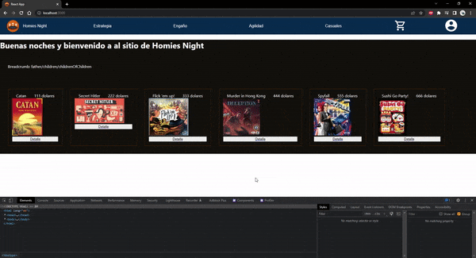

# Homies Night e-commerce

"Homies Night e-commerce" is my final project for [Coderhouse](https://www.coderhouse.com.uy/)'s React course. It consist of a website build with ReactJS for a hypothetical electronic commerce named "Homies Night".



## Installation

1. Install [NodeJSv16](https://nodejs.org/en/) (includes npm)
2. Use the package manage npm to install needed modules inside the project directory with ```npm install```
3. Run ```npm start``` script to host a development build
4. If all goes well, the website will open in your browser and you will see the following message in the console:
```
Compiled successfully!

You can now view homies-night-helguera in the browser.

  Local:            http://localhost:3000
  On Your Network:  http://192.168.1.2:3000

Note that the development build is not optimized.
To create a production build, use npm run build.

webpack compiled successfully
```

## Dependencies

* **Animate.css v4.1.1:** Library used to animate components.
* **Create React App v^5.0.1**: Enviroment to start up project.
* **React v18.2.0:**  Component based framework and the main prillar of the project.
* **React dom v^18.2.0:** Contains react-dom/client package, which provides client-specific methods used for initializing an app on the client.
* **React router dom v^6.3.0:** Provides a routing library for the website navigation.
* **Firebase v^9.9.1:** Google firebase API. Mainly used for fetching data from its firestore.
* **SweetAlert v11.4.26:** Library used for toasts and alerts.

## Production build

The last production build is hosted at [Netlify](https://www.netlify.com/). 

It can be accessed through the following link: 
[Homies Night](https://homiesnight.netlify.app/)

## Available Scripts

In the project directory, you can run:

### `npm start`

Runs the app in the development mode.\
Open [http://localhost:3000](http://localhost:3000) to view it in your browser.

The page will reload when you make changes.\
You may also see any lint errors in the console.

### `npm test`

Launches the test runner in the interactive watch mode.\
See the section about [running tests](https://facebook.github.io/create-react-app/docs/running-tests) for more information.

### `npm run build`

Builds the app for production to the `build` folder.\
It correctly bundles React in production mode and optimizes the build for the best performance.

The build is minified and the filenames include the hashes.\
Your app is ready to be deployed!

See the section about [deployment](https://facebook.github.io/create-react-app/docs/deployment) for more information.

### `npm run eject`

**Note: this is a one-way operation. Once you `eject`, you can't go back!**

If you aren't satisfied with the build tool and configuration choices, you can `eject` at any time. This command will remove the single build dependency from your project.

Instead, it will copy all the configuration files and the transitive dependencies (webpack, Babel, ESLint, etc) right into your project so you have full control over them. All of the commands except `eject` will still work, but they will point to the copied scripts so you can tweak them. At this point you're on your own.

You don't have to ever use `eject`. The curated feature set is suitable for small and middle deployments, and you shouldn't feel obligated to use this feature. However we understand that this tool wouldn't be useful if you couldn't customize it when you are ready for it.

